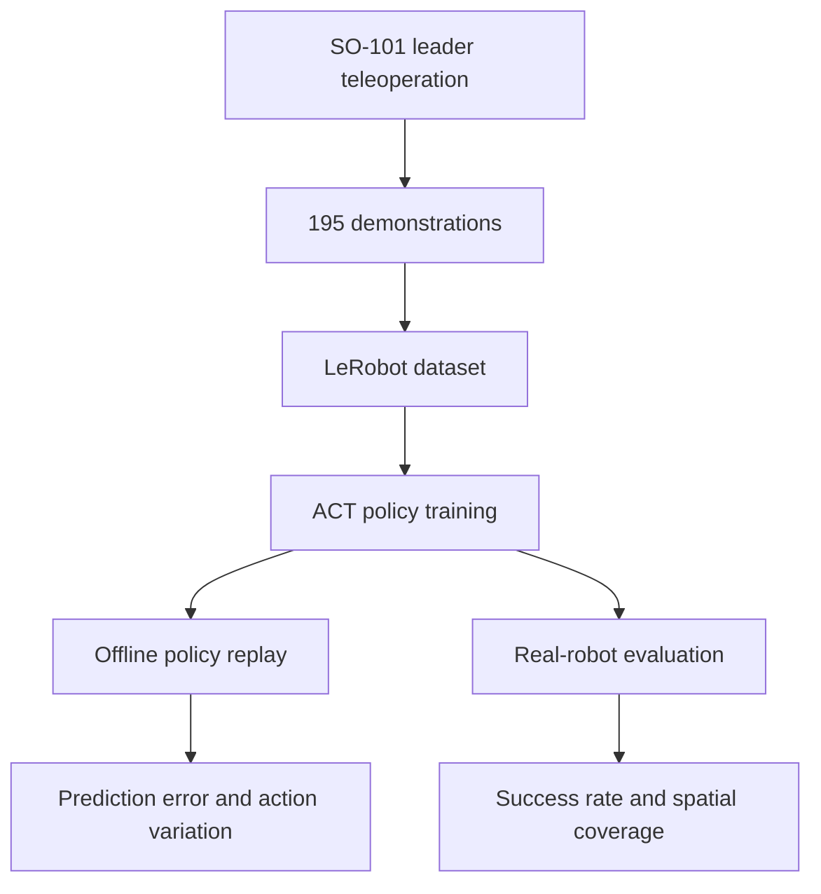

# Imitation Learning-Based Automated Grasping of Wire Harnesses

This repository contains the project-specific code and reproducibility material for the master's thesis **"Imitation Learning-Based Method for Automated Grasping of Wire Harness"** by Yue Xing at the Institute for Factory Automation and Production Systems (FAPS), Friedrich-Alexander-Universitat Erlangen-Nurnberg.

The project investigates whether an end-to-end visuomotor imitation-learning policy can learn to approach, grasp, transfer, and lift a flexible wire harness directly from real-robot demonstrations, without explicitly reconstructing the harness geometry or manually defining a trajectory for each initial configuration.

## Highlights

- SO-101 leader-follower teleoperation and deployment system
- Two RGB observations: a fixed top view and a gripper-mounted front view
- Six-dimensional robot state and action space: five arm joints and one gripper
- 195 real-robot demonstration episodes in LeRobotDataset v3.0 format
- 174,140 recorded frames at a nominal 30 Hz
- Ten Action Chunking with Transformers (ACT) configurations evaluated
- Spatially stratified physical evaluation over a 6 x 3 workspace grid
- Best tested configuration: 21 successful trials out of 36 (58.3%)

## System Overview



The experimental system uses:

| Component | Configuration |
| --- | --- |
| Leader robot | SO-101 leader arm |
| Execution robot | SO-101 follower arm with parallel gripper |
| Global observation | Fixed top-view RGB camera |
| Local observation | Front-view RGB camera mounted near the gripper |
| Image resolution | 640 x 480 pixels per camera |
| Nominal recording rate | 30 Hz |
| Policy observation | Two RGB images and a 6D robot state |
| Policy output | Future sequence of 6D absolute target-position actions |
| Deployment computer | NVIDIA Jetson AGX Orin Developer Kit |
| Training workstation | NVIDIA RTX A6000, 49,140 MiB GPU memory |

The two camera streams, robot state, and demonstrated action are associated by a common dataset frame index. Their alignment is software-level rather than hardware-triggered synchronization.

## Task Definition

The policy must complete the following behavior:

1. Approach an accessible section of the wire harness.
2. Align the gripper with the preferred grasp region.
3. Close the gripper and establish a stable grasp.
4. Retain and transfer the harness.
5. Lift the grasped section from the tabletop within 60 seconds.

Pushing or dragging the harness without lifting it is not considered success. A grasp is valid only if the harness is securely retained and moves with the gripper.

The experiments use one approximately 30 cm flexible wire harness under controlled camera, lighting, background, and workbench conditions.

## Dataset

The demonstration dataset is available on Hugging Face:

**[kb127/test195](https://huggingface.co/datasets/kb127/test195)**

| Property | Value |
| --- | --- |
| Format | LeRobotDataset v3.0 |
| Episodes | 195 |
| Frames | 174,140 |
| Average frames per episode | 893.03 |
| Average stored duration | 29.77 s per episode |
| Sampling frequency | 30 Hz |
| Operators | 1 |
| Collection regions | Left, center, and right |
| Episodes per collection region | 65 |
| Camera streams | `observation.images.front`, `observation.images.top` |
| State feature | `observation.state` in R6 |
| Action feature | `action` in R6 |

The main dataset directories are:

```text
data/     Frame-level robot data and indices in Parquet files
meta/     Dataset description, statistics, tasks, and episode metadata
videos/   Separate MP4 streams for the front and top cameras
```

The state and action channel order is:

```text
shoulder_pan, shoulder_lift, elbow_flex, wrist_flex, wrist_roll, gripper
```

All 195 episodes were used for training. No independent training, validation, or offline test split was created. Offline errors therefore measure action reconstruction within the recorded data distribution and must not be interpreted as held-out test performance.

## ACT Policy

The implementation uses the ACT policy provided by LeRobot and adapts it to the two-camera, single-arm SO-101 setup.

### Inputs and outputs

```text
observation.images.front : B x 3 x 480 x 640
observation.images.top   : B x 3 x 480 x 640
observation.state        : B x 6
action target            : B x H x 6
predicted action         : B x H x 6
```

Only the current observation is used (`n_obs_steps = 1`). The two images are processed by a shared ImageNet-pretrained ResNet-18 backbone. ACT predicts an action chunk of length `H = chunk_size`; the controller executes `n_action_steps` predictions before processing a new observation.

### Preprocessing

- RGB images are converted from HWC `uint8` arrays to CHW floating-point tensors.
- Pixel values are scaled to `[0, 1]` and normalized with ImageNet channel statistics.
- The original 480 x 640 spatial resolution is retained.
- Image resizing, cropping, and augmentation are disabled.
- Robot state and action features are independently standardized using dataset means and standard deviations.
- Predicted actions are inverse-standardized before being sent to the robot.

### Baseline configuration

| Parameter | Value |
| --- | --- |
| Policy | ACT |
| Observation steps | 1 |
| Chunk size | 100 |
| Executed action steps | 100 |
| Vision backbone | ResNet-18, ImageNet1K_V1 initialization |
| Model dimension | 512 |
| Feed-forward dimension | 3200 |
| Attention heads | 8 |
| Transformer encoder layers | 4 |
| Transformer decoder layers | 1 |
| VAE encoder layers | 4 |
| Latent dimension | 32 |
| Dropout | 0.1 |
| KL weight | 10 |
| Reconstruction loss | Masked L1 loss |
| Optimizer | AdamW |
| Policy learning rate | 1e-5 |
| Backbone learning rate | 1e-5 |
| Weight decay | 1e-4 |
| Gradient-clipping norm | 10 |
| Training steps | 600,000 |
| Mixed precision | Disabled |
| Temporal ensembling | Disabled |

## Recorded Software Environments

### Training

| Component | Version |
| --- | --- |
| Operating system | Ubuntu 22.04.5 LTS |
| Architecture | x86_64 |
| Python | 3.12.12 |
| LeRobot | 0.5.1 |
| PyTorch | 2.10.0+cu128 |
| PyTorch CUDA runtime | 12.8 |
| NVIDIA driver | 580.126.16 |
| Torchvision | 0.25.0 |
| Transformers | 5.3.0 |
| Accelerate | 1.13.0 |
| Hugging Face Hub | 1.7.1 |
| NumPy | 2.2.6 |

### Deployment

| Component | Version or configuration |
| --- | --- |
| Platform | NVIDIA Jetson AGX Orin Developer Kit |
| Operating system | Ubuntu 22.04.5 LTS |
| Architecture | AArch64 |
| Linux kernel | 5.15.148-tegra |
| Python | 3.12.12 |
| Environment manager | Miniforge / Conda |
| CUDA toolkit | 12.6 |
| CUDA compiler | NVCC 12.6.68 |

The exact LeRobot and PyTorch versions on the Jetson were not retained in the recorded system information and are therefore intentionally not claimed here.

## Getting Started

Clone the project repository:

```bash
git clone https://github.com/kb127XY/thesis.git
cd thesis
```

Install LeRobot 0.5.1 and a PyTorch build compatible with the target CUDA environment. The recorded versions above describe the environment used for the thesis experiments; equivalent versions are recommended when reproducing the reported results.

Download the dataset with the Hugging Face CLI:

```bash
hf download kb127/test195 --repo-type dataset --local-dir datasets/test195
```

Training, offline evaluation, and real-robot deployment require machine-specific dataset paths, checkpoint paths, camera identifiers, and robot serial interfaces. Verify these settings before execution. The upstream LeRobot source is not duplicated in this repository when it was used without modification; this repository is intended to retain only project-specific code, configurations, evaluation utilities, and trial-derived outputs.

## Evaluation Protocol

The reachable tabletop area is approximately 60 x 35 cm. It is divided into a 6 x 3 grid with columns A-F and rows 1-3. Each policy configuration is tested twice in every cell, producing 36 valid physical trials.

For every trial:

- the robot returns to a predefined home pose;
- the gripper is reset to the same initial opening;
- the harness is placed approximately vertically in the assigned cell;
- at least part of the harness must be visible in the top camera;
- the action queue and temporary execution state are cleared;
- autonomous execution runs at a nominal target frequency of 30 Hz; and
- the trial ends on success, failure, timeout, safety intervention, or a policy-independent invalid condition.

Policy-related safety interventions count as failures. Trials interrupted by independent camera, communication, or control-system faults are invalid and repeated in the same grid cell.

The primary metrics are:

- real-robot task-success rate;
- workspace cells with at least one success;
- offline Action L1 and Gripper L1 error after inverse standardization; and
- first-order predicted-action variation as a motion-smoothness diagnostic.

## Results

`C` denotes `chunk_size`, `A` denotes `n_action_steps`, and `KL` denotes the KL-divergence weight.

| Configuration | Trials | Successes | Success rate |
| --- | ---: | ---: | ---: |
| C100-A50-KL10 | 36 | 0 | 0.0% |
| C50-A50-KL10 | 36 | 0 | 0.0% |
| C100-A100-KL5 | 36 | 10 | 27.8% |
| Baseline: C100-A100-KL10 | 36 | 8 | 22.2% |
| C100-A80-KL10 | 36 | 4 | 11.1% |
| C100-A100-KL10-LR3e-5 | 36 | 2 | 5.6% |
| C100-A100-KL15 | 36 | 14 | 38.9% |
| C100-A100-KL18 | 36 | 6 | 16.7% |
| C150-A100-KL10 | 36 | 13 | 36.1% |
| **C150-A100-KL15** | **36** | **21** | **58.3%** |

The best tested configuration improved the success rate by 36.1 percentage points over the baseline and achieved at least one success in 12 of the 18 grid cells. Nine cells produced two successes out of two trials.

### Offline error does not predict physical success

| Configuration | Mean Action L1 | Physical success rate |
| --- | ---: | ---: |
| C100-A100-KL10-LR3e-5 | **3.655** | 5.6% |
| C150-A100-KL15 | 11.089 | **58.3%** |

The configuration with the lowest retained offline Action L1 error was not the configuration with the highest real-robot success rate. Closed-loop physical testing and spatial coverage are therefore essential; offline reconstruction metrics alone are insufficient for selecting a manipulation policy.

## Limitations

The reported system is a proof of concept rather than a production-ready wire-harness assembly solution.

- Only one wire harness and one operator were used.
- Camera poses, background, lighting, robot base, and workbench remained fixed.
- The dataset has no held-out validation or test split.
- Each grid cell has only two physical repetitions per policy.
- Each configuration is represented by one training run, so hyperparameter effects are not separated from training stochasticity.
- The study evaluates grasping, transfer, and lifting, not connector insertion, routing, clipping, or complete harness assembly.
- The robot has no explicit depth, force, torque, or tactile sensing.
- The policy has no dedicated out-of-distribution detection, failure recovery, collision-aware motion planning, or safety-verification layer.

## Future Work

- Expand the dataset across multiple operators, harness types, environments, and camera conditions.
- Introduce held-out splits, repeated training seeds, and more physical trials per cell.
- Integrate the existing YOLO connector detector with connector pose estimation.
- Combine ACT with MoveIt or OMPL for collision-aware motion planning and insertion.
- Add depth, force-torque, tactile, or gripper-force sensing.
- Compare ACT fairly with Diffusion Policy, SmolVLA, pi0, and pi0-FAST.
- Evaluate fine-tuned robotic foundation models on unseen harnesses and visual environments.
- Extend the spatial protocol into a standardized real-world wire-harness manipulation benchmark.

## Related Resources

- [Project repository](https://github.com/kb127XY/thesis)
- [Demonstration dataset: kb127/test195](https://huggingface.co/datasets/kb127/test195)
- [LeRobot](https://github.com/huggingface/lerobot)

